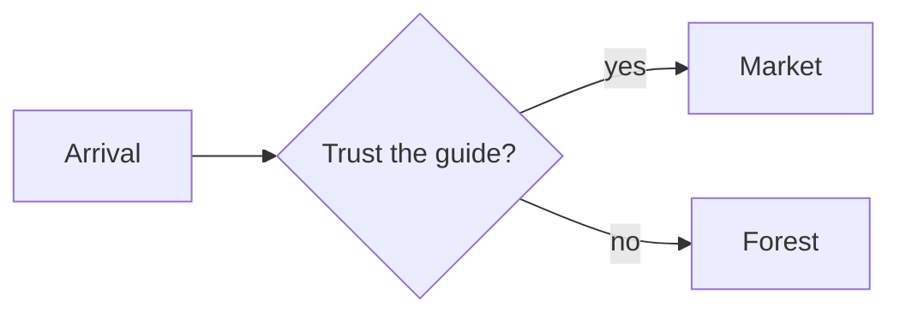

# Structure and flow

How a script is organized into scenes and how a reader moves through it:
succession, choices, jumps, conditions, and the ways a run ends.

Part of the [script language specification](script-language.md).

## Table of contents

- [Succession](#succession)
- [Choices](#choices)
- [Random choices](#random-choices)
  - [Dynamic weights](#dynamic-weights)
- [Jumps](#jumps)
- [Conditional jumps](#conditional-jumps)
- [Conditional lines](#conditional-lines)
- [Conditional choices](#conditional-choices)
- [Conditional blocks](#conditional-blocks)
- [Ending a run](#ending-a-run)
- [Comments](#comments)
- [Front matter](#front-matter)
- [Authoring aids](#authoring-aids)

Dialogue sections become graph nodes and edges. Linear lines create succession
edges. Choices and jumps create branches.

## Succession

When one text line follows another, the second line is the only successor of the
first line. Separate successive speeches with a **blank line** so that each
speech is its own Markdown paragraph.

```markdown
Alice @A #main: Hello, Bob!

Bob @B #npc: Hello, Alice!
```

The script language follows standard Markdown line-break rules, so a Markdown
preview groups lines into speeches exactly as the compiler does:

- A **blank line** starts a new speech. This is the primary, most readable way to
  separate successive speeches.
- A **soft break** (a plain newline with no blank line) keeps both lines in the
  same speech. Use it to wrap one long speech across several source lines.
- A **hard break** starts a new speech without a blank line, for a compact
  layout. Make a break hard in either of the two standard Markdown ways: end the
  line with two or more trailing spaces, or end it with a backslash (`\`).

A soft break wraps a single speech across source lines; it is still one speech:

```markdown
Alice: This is a single long speech that the author wrapped across
several source lines for readability. It is still spoken as one speech.
```

A hard break separates two speeches without a blank line. The trailing backslash
below is one of the two hard-break forms; two trailing spaces are the other:

```markdown
Alice: Hello, Bob!\
Bob: Hello, Alice!
```

## Choices

Use `-` to offer selectable responses.

```markdown
Alice: The weather is nice today!
- Bob: Is it really?
- Bob: Yes, I agree.
```

Choices can be nested, but deep nesting becomes hard to scan. For a deeply
nested branch, consider moving it into a new scene and jumping to it instead.

```markdown
Alice: The weather is nice today!
- Bob: Is it really?
    - Alice: Yes. Let's play tennis!
- Bob: Yes, I agree.
    - Alice: Wonderful. Let's play tennis!
```

Choice **ordering** follows the list type. An **ordered** list (`1.`, `2.`, …)
means the choices must be presented in that textual order. An **unordered** list
(`-`) leaves later stages free to shuffle the display order — useful when the
options should appear in a random order.

## Random choices

Sometimes you want the *engine* to pick, not the player — a guard who greets you
one of several ways, a coin that lands heads or tails. Give an option a **weight**
— a code span ending in `%` — and the whole list becomes a **random choice**: at
runtime the engine selects exactly one option by weight and runs its body. No
menu is shown.

```markdown
The coin spins in the air.

- `50%` It lands heads.
- `50%` It lands tails.
```

Weights are **relative** — they are normalized by their sum, so equal numbers
mean equal odds no matter the total. Write them as the percentages you intend;
if they do not add up to 100, the compiler normalizes them and warns.

A bare `` `%` `` is an **auto** weight: it takes an equal share of whatever
percentage the explicit weights leave. Pin the odds that matter and let the rest
divide evenly.

```markdown
- `70%` Guard: Halt! Who goes there?
- `%`   Guard: ...oh, it's you.
```

Above, the auto weight resolves to the remaining 30%. Several autos split the
leftover equally, so `` `%` `` + `` `%` `` is a plain 50/50, and an all-auto list
is a convenient uniform random.

Each option's body is an ordinary choice body, so a random choice nests and
carries dialogue exactly like a player choice:

```markdown
- `80%` Merchant: Fresh apples!
    - Alice: I'll take one.
- `20%` Merchant: ...bad day for business.
```

A few rules keep random choices unambiguous:

- **Every option must carry a weight** once any option does. A bare option in a
  random choice is an error; write `` `%` `` to give it an equal share instead.
- **The weight comes first**, before the speaker. A code span ending in `%` is
  only a weight in this leading position; elsewhere it is ordinary inline code.
- **A Markdown preview** shows each weight as inline code (`50%`) at the start of
  the option — readable, and clearly not spoken text.

### Dynamic weights

A weight can also be **computed from game state**. Wrap a [key](game-state.md#quoting-a-key) in
a code span and end it with `%`; its runtime numeric result becomes the option's
weight. The key may be written unquoted here, as below:

```markdown
The rival spots you across the courtyard.

- `Bob.Affection%`       Bob: ...good to see you.
- `Christina.Affection%` Christina: Oh — hello.
```

The engine reads each query through `IGameSystem.Query`, treats the result as a
percentage, and picks one line by weight — so the character most fond of the
player is the most likely to greet them. Static, auto, and dynamic weights mix
freely in one list:

```markdown
- `50%`              Guard: Halt!
- `Guard.Suspicion%` Guard: ...I'm watching you.
- `%`                Guard: Move along.
```

Because the numbers are unknown until the game runs, the usual "weights should
total 100%" check is **deferred to runtime** for any list that contains a
dynamic weight. At runtime:

- Each query must resolve to a **finite, non-negative number**. A missing,
  non-numeric, negative, or infinite result is an error, and the engine selects
  no option.
- Auto weights take an equal share of what is left after **both** the static and
  the resolved dynamic weights: `max(0, 100 − static − dynamic) / autoCount`.
- The resolved weights are then normalized by their sum, exactly like static
  weights: a zero total is an error, and a total far from 100 warns.

## Jumps

A jump is `=>` followed by a Markdown-style link.

```ebnf
Jump = "=>" , MarkdownLink ;
```

Use same-file anchors for local dialogue and relative paths for cross-file
dialogue.

```markdown
=> [Play tennis](#play-tennis)
=> [Meet Bob](chapter-02.md#meet-bob)
```

> [!NOTE]
> **A jump cannot appear inside a heading.** A heading marks a scene, which is
> itself a jump *target*, so jumping from within one is meaningless.
>
> ```markdown
> ## => [Play tennis](#play-tennis)
> ```
>
> The `=>` becomes plain heading text and the link stays an ordinary link — the
> heading reads as "`=>` Play tennis", not a jump.

<!-- Separate the two adjacent callouts (MD028). -->

> [!NOTE]
> **A jump must be written on a single line.** The `=>` and its link may be
> separated by spaces, but a line break between them ends the jump.
>
> ```markdown
> =>
> [Play tennis](#play-tennis)
> ```
>
> The `=>` becomes plain text and the link stays an ordinary link — two separate
> pieces, not a jump.

An arrow with no link after it is not a jump at all: it is read literally and
stays on the page as the two characters. Because an intended jump would
otherwise vanish without a trace, the compiler warns about it — including the
line-break case above, where the arrow and its link are split apart.

```markdown
=> The market
```

Example:

```markdown
## Greetings

Alice: The weather is nice today!
- Bob: Is it really?
    - Alice: Yes. Let's play tennis!
        => [Play tennis](#play-tennis)
- Bob: Yes, I agree.
    - Alice: Wonderful. Let's play tennis!
        => [Play tennis](#play-tennis)

## Play tennis

Alice: Tennis is fun!

Bob: Yes, I agree.
```

## Conditional jumps

Make a jump *optional* by placing a **condition** in front of it — a
[query](game-state.md#queries) with a `?` added inside the code span. The jump fires only when
the query reads as true:

```markdown
`FoundKey?` => [Open the vault](#the-vault)

The door stays shut. You look for another way.
```

If `FoundKey` is true, the reader jumps to *The Vault*; if it is false, the jump
is skipped and reading continues with the next line.

A condition is the third member of the query family: `` `"key"` `` inserts a
value, `` `key%` `` weights a random option, and `` `key?` `` reads a boolean.
The game decides what the key means and returns `true` or `false`; an unset value
counts as false.

The key may be written unquoted, as above — see [Quoting a key](game-state.md#quoting-a-key).
Quote it only when the key must *end* in a literal `?`; the trailing `?` after the
closing quote is then unmistakably the operator:

```markdown
`"Rainy?"?` => [Wait out the storm](#the-inn)
```

To branch when a flag is **false**, query a game-defined inverse — there is no
`not` operator:

```markdown
`NotRainy?` => [Set off across the moor](#the-moor)
```

A condition guards **one** jump. For an alternative, put another jump on the next
line, as its own paragraph:

```markdown
`FoundKey?` => [Open the vault](#the-vault)

=> [Search the study](#the-study)
```

If the key is found the reader takes the vault; otherwise the plain jump to the
study runs. Keep them in separate paragraphs: a jump is non-returning, so a
second jump in the same paragraph can never play — the compiler warns about the
unreachable content.

A conditional jump follows every [jump](#jumps) rule: it lives on one line, its
pieces may be separated by spaces but not a line break, and it cannot appear in a
heading.

## Conditional lines

Start a line with a **condition** to play the whole line only when the query
reads as true. The condition goes at the very start of the line, before the
speaker:

```markdown
`Angry?` Guard: You again? Get out.

The guard says nothing and waves you through.
```

If `Angry` is true, that line plays; if it is false, the line is skipped and
reading continues with the next line. The condition is not spoken — it sits
before the speaker, and `Guard` is still recognized as the speaker.

A line with no speaker can be conditional too:

```markdown
`Returned?` Welcome back. It has been too long.
```

As with a [conditional jump](#conditional-jumps), there is no `not` and no inline
*else*: query a game-defined inverse, or write the alternative as its own line —
often a second conditional line testing the opposite flag.

```markdown
`Angry?` Guard: You again? Get out.
`NotAngry?` Guard: Back so soon? Go on through.
```

A condition must lead the line it guards; a `` `key?` `` alone on a line, or one
buried mid-line after the speaker, has nothing to guard and is an error.

## Conditional choices

Front a **choice option** with a condition to offer it only when the query reads
as true. The condition goes at the very start of the option:

```markdown
- `HasKey?` Use the key on the lock.
- Search for another way in.
```

If `HasKey` is true the reader sees both options; if it is false only *Search for
another way in* is offered. The condition guards the whole option, not just its
first line.

A [random option](#random-choices) can be conditional too — the condition comes
**first, before the weight**:

```markdown
- `IsAngry?` `50%` The guard glares and blocks your path.
- `30%` The guard waves you through.
- `20%` The guard ignores you.
```

When `IsAngry` is true the engine picks among all three by weight; when it is false
the first option is left out and the remaining weights are re-normalized — a random
pool with a dynamic set of options.

As with a [conditional jump](#conditional-jumps) or line, each option's condition
is independent and there is no inline *else*: query an inverse flag for the
opposite case. A condition must lead the option it guards; one with nothing to
guard is an error.

## Conditional blocks

The [conditional line](#conditional-lines), [choice](#conditional-choices), and
[jump](#conditional-jumps) each guard **one** thing, on its own, with no *else*.
To guard a whole **group** — several lines, a jump, a command — and give it a
fallback, use a **conditional block**: `if` / `elseif` / `else` branches wrapped
in one blockquote.

```markdown
> `if` `Rich?`
>
> Guard: Ah — my lord. The gate is yours.
>
> => [The courtyard](#the-courtyard)
>
> `elseif` `Poor?`
>
> Guard: Back to the gutter with you.
>
> `else`
>
> Guard: I don't know your face. What business have you?
```

Zero or one branch plays: the first `if` or `elseif` whose condition reads as
true, or the optional `else` when none do. Without a matching condition or an
`else`, the whole block is skipped. A branch may hold as many lines as you like,
along with jumps and commands.

**One blockquote, kept connected.** Every branch — the `if`, each `elseif`, and
the `else` — lives in the **same** blockquote: each line starts with `>`, and the
blank line *between* branches is a bare `>` so the quote never breaks. The
blockquote itself marks where the block ends, so there is no closing keyword. If a
plain blank line (without `>`) splits the branches apart, the stray `elseif` or
`else` is an error — it is no longer connected to its `if`.

**Write the marker as two code spans** — the keyword and the condition —
`` `if` `` `` `Rich?` ``, not one. (`` `if Rich?` `` reads as a single condition on a
key named *if Rich*.) The `` `else` `` takes no condition.

**Nesting.** A branch can hold another conditional block, one level deeper with
`> >`:

```markdown
> `if` `Rich?`
>
> Guard: Welcome.
>
> > `if` `Armed?`
> >
> > Guard: But leave your blade at the post.
```

**Blank lines are quoted — and they close a nested branch.** The blank line
between utterances (which every line needs) is written with `>` inside a block, so
the quote never breaks. That quoted blank line is also what **ends a nested block**:
after a `> >` branch, a bare `>` line returns you to the outer branch. Omit it and
Markdown pulls the next line — even an `elseif` or `else` — *into* the nested
branch, so a marker that lands mid-paragraph is an error. Always write the bare `>`
line where a nested block ends.

**Choosing a scene by condition.** A conditional block groups *content*, not
scenes — a scene heading may not sit inside a branch. To send the reader to one of
several scenes by condition, use conditional [jumps](#conditional-jumps) to
top-level scenes instead:

```markdown
`Rich?` => [The lord's hall](#the-lords-hall)
`Poor?` => [The gutter](#the-gutter)
```

In a plain Markdown preview a conditional block renders as one indented, grouped
quote — a single bar down the side, a nested branch one level deeper.

As with every other conditional, there is no `not`: query a game-defined inverse
flag for the opposite case.

## Ending a run

`#END` is a reserved jump target that ends the current run. Divert to it to stop
the dialogue at a definite endpoint:

```markdown
Guide: The road ends here. Farewell, traveler.

=> [The end](#END)
```

`#END` is uppercase and reserved, so it can never collide with one of your
scenes: a heading's anchor is always lowercased (a `# End` heading anchors to
`#end`), while `#END` is matched exactly. There is no `# End` heading to write —
`#END` is always available as a target.

In a Markdown preview `=> [The end](#END)` renders as an ordinary link. Because
`#END` matches no heading, the link simply scrolls nowhere; the compiler
recognizes it as the reserved endpoint.

> [!NOTE]
> Reaching `#END` stops a run *early*. How reading otherwise flows from one scene
> to the next — the dialogue's progression order — and the runtime that walks it
> are still in progress; see the *Progression Order* design note for the model.

## Comments

Because the DSL is Markdown-inspired, use Markdown-compatible HTML comments for
author notes.

```markdown
Alice @A #main: Hello, Bob! <!-- Alice speaks in a warm tone. -->

Bob @B #npc: Hello, Alice!
```

## Front matter

A script may open with a **front matter** block — a `---`-fenced section of
metadata (title, tags, author, and the like) at the very top of the file. It is
never spoken and is **always discarded**, like a comment. Unlike authoring aids,
this is not configurable: metadata is never speech.

Only a block at the document start is front matter; a `---` later in the script
is a thematic break (an authoring aid).

```markdown
---
title: Reunion
tags: [chapter-1, intro]
---

Alice: Hello, Bob!
```

## Authoring aids

Markdown constructs that organize the script rather than say something —
**tables**, **fenced code blocks** (including diagrams like mermaid), and
**thematic breaks** (`---`) — are treated as author-only aids and are **dropped
from speech by default**, much like comments. Use them freely to document
speakers, sketch scene relationships, or divide sections.

The web report renders a fenced `mermaid` block as a diagram while keeping it
outside the compiled dialogue:

````markdown

````

```markdown
<!-- A table of who appears in this scene — never spoken. -->

| Speaker | Mood  |
| ------- | ----- |
| Alice   | happy |
| Bob     | shy   |

Alice: Nice to see you, Bob!
```

> [!NOTE]
> Which unmodeled constructs are dropped versus kept as literal speech is
> configurable per project in a `dialogue.toml` file. See the internal
> *Unmodeled Markdown Handling* note for the defaults and how to override them.
